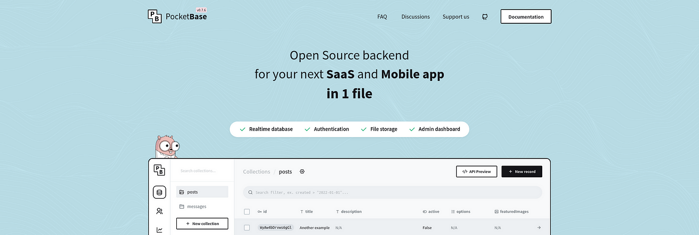
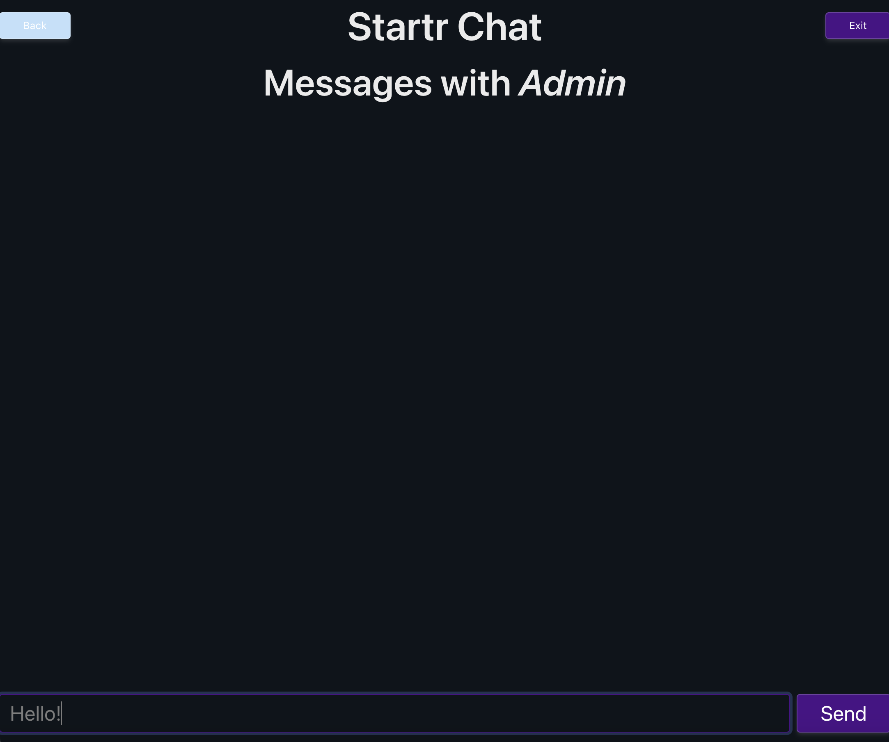
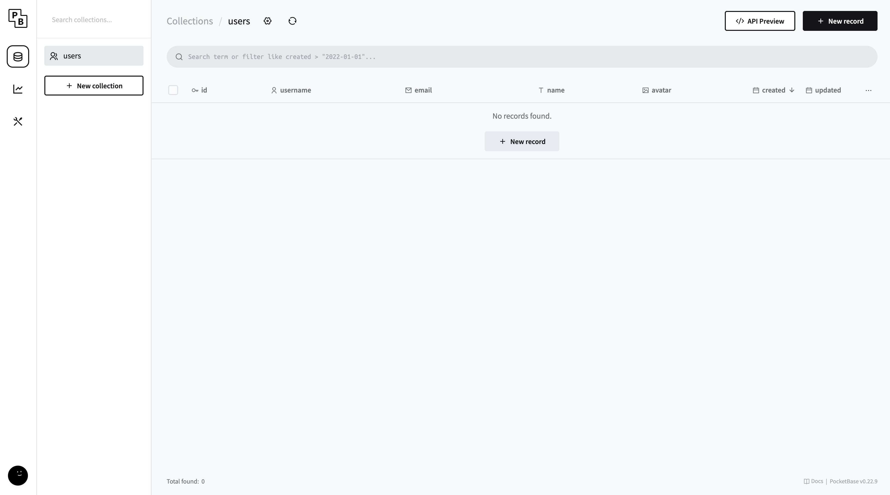
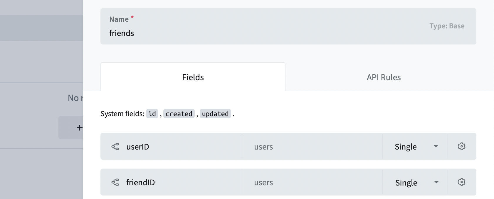
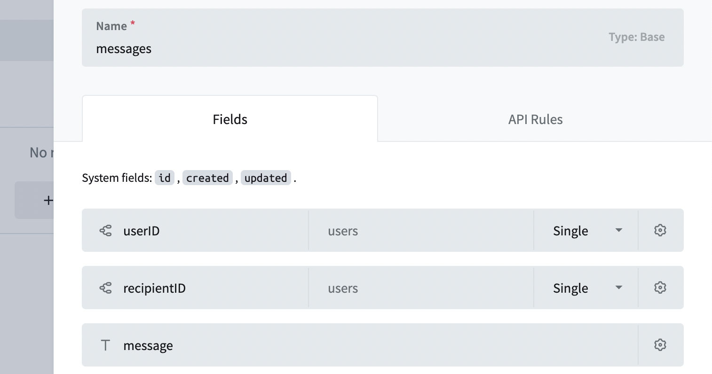
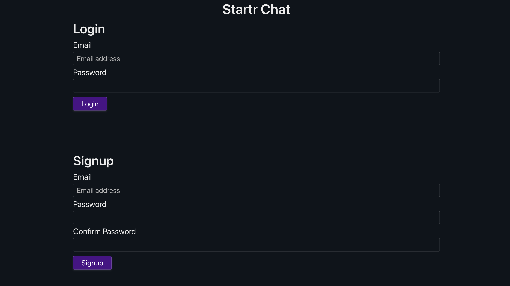
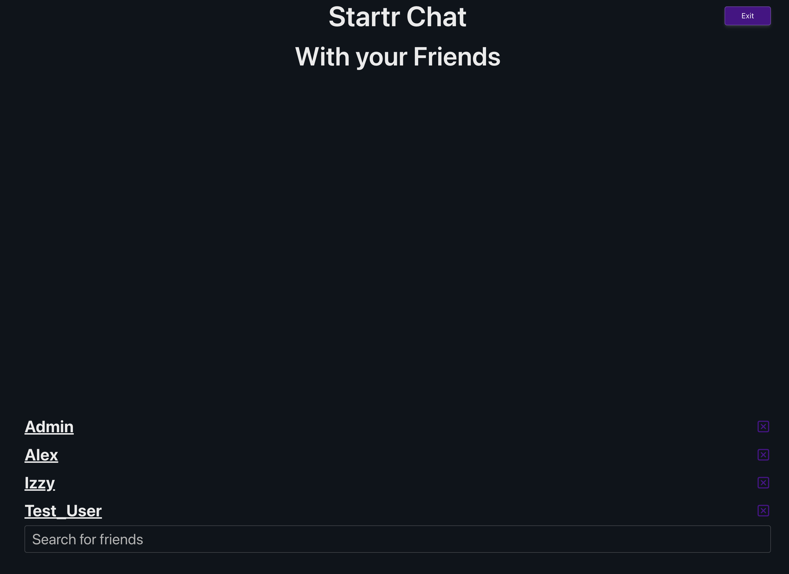
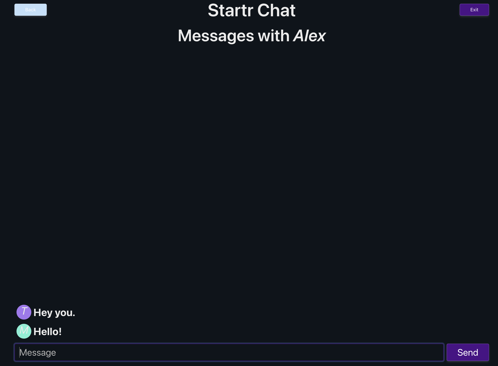
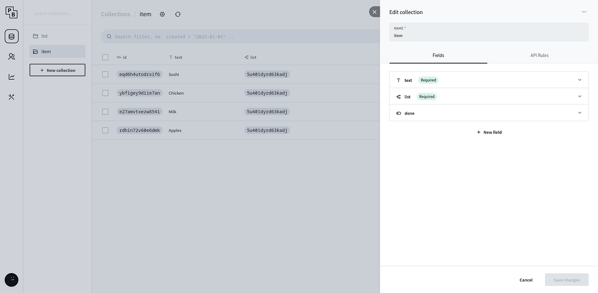

# Startr Pocketbase-Chat

## Introducing [[Projects/Curriculum/Startr.Team/Startr.Team|Startr.Team]] [[Pocketbase Chat)

Ever dreamed of launching a website or app in record time? Eager to transform a concept into a functional project that you, your friends, and family can start using within days? If so, you're in the right place. Let me walk you through how you can achieve just that, with a story and a guide to streamline the process.

Picture this: you're nestled in a cozy cafe, your favorite beverage in hand, and your laptop ready to bring your next big idea to life. It sounds idyllic, doesn't it? This is precisely the kind of experience I strive for—creating innovative projects quickly and effortlessly. I focus on simplicity, avoiding cumbersome frameworks and complex setups that could bog me down. I prefer avoiding heavy SaaS solutions unless absolutely necessary. The goal is to stay unburdened and focused on creativity.

Let’s break down the essentials of website building. There are two primary components: the front end and the back end. The front end is what users interact with—it’s the visual aspect of your website or app, constructed with HTML and JavaScript. Think of it as the face of your digital creation. On the other hand, the back end serves as the behind-the-scenes powerhouse, handling data processing and storage. It’s the brain of your website, operating out of sight but crucial for functionality.

Today, let’s explore a streamlined approach to developing the back end using low-code platforms. These tools offer a straightforward way to build and manage your backend without delving into complex code. By leveraging low-code solutions, you can accelerate development, allowing you to focus more on refining your front end and user experience.

In this guide, we’ll dive into how to effectively use these low-code platforms, making the process of bringing your ideas to life faster and more enjoyable. Whether you’re an aspiring entrepreneur or simply looking to experiment with a new project, this approach will help you bypass many of the traditional hurdles and get your creation up and running swiftly.

### **Streamlining Your Setup with Startr Stack and Startr.Style**

**Getting everything ready for a new project can sometimes feel like piecing together a complex puzzle. That’s why I rely on my Startr.sh quick setup and Startr.Style to simplify the process from the get-go.

[[Want to learn more? Schedule your next free startr lesson now.)

Before diving into other things, lets focus on our immediate lesson: how to build a simple messaging platform powered by **Pocketbase**. If you find joy in engaging with projects during your spare time, you’re going to love this: **Pocketbase**. This free, open-source tool allows you to establish the core infrastructure for your next app or service using just a single file. 

And yes, it’s completely free! Pocketbase provides you with a streamlined control panel, a straightforward database, and user management features—all consolidated into one elegant package. 

Excited? Let's dive in together and build an amazing **Chat App** using **Pocketbase**!`

## Build a Startr Chat App  with Pocketbase in no time



https://pocketbase.io

###  TODO switch this section: chat.startr.space
- [ ] #todo link to startr.sh

To give you a taste of what we’re going to build, he’s the final project up and running on chat.startr.space. Feel free to play with it as much as you want! :)

- [ ] #todo host instance of our chat
	- [ ] setup with Docker
	- [ ] Move to [CapRover | Server Dashboard](https://captain.production.openco.ca/#/login)
- [ ] Add screenshots



### Setting Pocketbase Up

Let's get started with installing Pocketbase! 

#### If you want to learn how build the entire project: 

Follow these first straightforward steps. Alternatively, if you're crunched for time, [[#Dive right into a working chat app?|jump ahead) and [download our completed open source project](https://github.com/Startr/WEB-Pocketbase-Chat/archive/refs/heads/master.zip), we've set it up so that it will do all of these initial steps automatically (if you're setup to use [[npm)).

- [ ] #todo small npm writeup.

1. Grab a [copy of Pocketbase from our project](https://github.com/Startr/WEB-Pocketbase-Chat/tree/master/bin/pocketbase_versions). Be sure to download the right version for your computer. 
	> **Note:** Make sure you choose the one that matches your operating system. For example, if you have a Mac, you'll want to download the macOS version. 🍎
	> **Note:** We've included a tool that checks to make sure you use the right one if you choose to [download our completed open source project](https://github.com/Startr/WEB-Pocketbase-Chat/archive/refs/heads/master.zip).
1. Create a new folder on your computer and name it **pocketbase-chat**. This is where we'll put all the Pocketbase files.
   > **Note:** I suggest you put it in a Projects folders in your `~/Documents` or `~/Desktop`
2. Unzip the Pocketbase executable file and put it inside the **pocketbase-chat** folder.
	1. This will unzip into a folder in your **pocketbase-chat** folder. Grab the `pocketbase` file in this new folder and move it to your **pocketbase-chat** folder and not in this new folder.
	2.  Let's try launching pocket base. On a mac you'll need to right click on it and select "Open". 
> 	**Note:** The latest versions of macOS with complain the first time you start doing this. Be sure to click "Open" in the popup.
> 	**Note:** You'll see some text in the terminal but this isn't how we use Pocketbase and most other server programs. Instead we'll need to learn how to use the terminal.
> 	**Note:** We might need to go over doing this for some people in another project. If you don't know how to use the terminal ask us for more help. #todo

3. Open a fresh window in your computer's terminal and type `` `cd pocketbase-chat` `` (but replace  pocketbase-chat  with the actual path to your new folder).
    
> 	**NOTE**: If you're on a Mac, after you type `cd ` you can drag your **pocketbase-chat** folder into the terminal instead of typing its exact location. How cool is that? 😄
> 	**Note:** Don't forget that space between the `cd` and the directory.

4. Finally, type this command in the terminal:
```bash
   ./pocketbase serve
```

And that's it! You've successfully installed Pocketbase to this folder. Now we can explore all the cool things it can do. Remember, if you need help, you can always check the official [Pocketbase documentation](https://pocketbase.io/docs/), and more amazing is that our server already has built in documentation. 

### Browse the server backend

If you've followed allong till now you've got and output similar to the following:

> Server started at: [`http://127.0.0.1:8090`](http://127.0.0.1:8090/)  
  - REST API: [`http://127.0.0.1:8090/api/`](http://127.0.0.1:8090/api/)  
  - Admin UI: [`http://127.0.0.1:8090/_/`](http://127.0.0.1:8090/_/)

That means that Pocketbase was successfully started.

Congrats! You now have a fully functional backend in place. How easy was that!? Feel free to look at the three urls before moving on. 

>**Note:** Copy the blue text in the terminal into the address bar of your browser to see the three main pages. **Don't forget to hit enter**. 
>**Note:** Two are 404 messages. **Don't fret, we'll get to that soon.**

#### Do you want to dive right into a working chat app?

##### Download the latest complete version of our example chat app and experiment.

Just want to be able to read over how it was built? You can [download our WEB-Pocketbase-Chat-master.zip and everything is there and ready to go including Pocketbase](https://github.com/Startr/WEB-Pocketbase-Chat/archive/refs/heads/master.zip). 

> **Note:** if you have npm installed we've even made it so you don't have to worry about which version of pocketbase if perfect for your computer. 

Open the zip file and it will create a folder called WEB-Pocketbase-Chat-master. You want to go to this folder in your terminal.  If you already have something running in the terminal, make sure to stop it. This can be done by control c.  Remember to change directory use the command `cd` followed by a space and the full dorectory location and name.

> **Note:** remember the Mac, you can drag'n drop that directory into the terminal after your `cd` command, and will put the full path, including the directory name. 

Once you're in the directory, let's run our `./bin/get_correct_pocketbase.sh` helper to make sure we have the correct version of pocketbase. 

> #todo make sure `./bin/get_correct_pocketbase.sh` works on all 'nix systems'

With everything set up run `./pocketbase serve` from you command line. This will give you the same urls as before. Go to them again you will at the first two you'll see the chat interface and the login. Make sure you checkout that last URL `127.0.0.1:8090/_/` 

[`http://127.0.0.1:8090/_/`](http://127.0.0.1:8090/_/) This is the back end and it has been setup and populated with a few users and messages. Feel free to poke around. If you break anything you can always restore from our copy.

- [ ] #todo  add default password and admin account for dev mode
### Setup the Data Base: 
#### Creating our  **Pocketbase** Collections

The next step to build our awesome [[Startr Pocketbase-Chat) App is creating our Data Model. Data models are how we organize our information it used to be the people would organize their information on index cards and then put these into cabinets. You can think of data models as the rules for organizing these index cards into various cabinets and what we can put on these index cards.

Most of the time we call data models, database models. In the Pocketbase world, those are called **Collections**.

We’ll have to create two of them:

- **Friends:** Representing lists of our users' friends 
- **Messages:** Representing the actual chat messages

Open our browser and head to our [Pocketbase Admin UI:](http://127.0.0.1:8090/_/) at [`http://127.0.0.1:8090/_/`](http://127.0.0.1:8090/_/) Pocketbase will ask you to provide an Admin username/password. Go ahead and set that up.  

>  **Note** this account is local only to this project on your computer. Don't worry about having to share it with others.

At our first login, you’ll see something like this:


#### Pocketbase Collections

Let’s go ahead and create a collection named “**friends”**. It will have two fields:

- **userID** of type “Relation” -> Users -> Single
- **friendID** of type “Relation” -> Users -> Single




We'll also create a collection named “**messages”**. It will have three fields:

- **userID** of type “Relation” -> Users -> Single
- **recipientID** of type “Relation” -> Users -> Single
- **message** of type plain text




Excellent! Pocketbase is now exposing APIs for our collections without our having to write a single line of code!

> **Note:** In a more advanced chat you'll want to use rich text and also add a field for attachments.

### Our Chat App: The HTML


To write our App, we’ll rely on a few dependencies:

- [ ] [Pocketbase client JS SDK](https://github.com/pocketbase/js-sdk): to simplify talking with [[Pocketbase)
- [ ] [AlpineJS](https://alpinejs.dev/): a lightweight reactive JS framework or
- [ ] #TODO  possibly swap out Alpine for Hyperscript
- [ ] [Startr.Style](https://startr.style): our teeny CSS framework with rocks!
- [ ] [UniCode](https://en.wikipedia.org/wiki/Unicode) : fun [Emoji faces](https://www.vertex42.com/ExcelTips/unicode-symbols.html#emoticons) and [icons](https://www.vertex42.com/ExcelTips/unicode-symbols.html) to spice things up :)

You can find the [complete  project code here](https://github.com/Startr/WEB-Pocketbase-Chat): 
- [I] [Startr/WEB-Pocketbase-Chat](https://github.com/Startr/WEB-Pocketbase-Chat) 
- [ ] #todo make public or move to our server

You can download our `index.html` and put it in folder called pb_public right next to your `pocketbase` file. Pocketbase not only works gives us access to our data but also serves any files in this folder.

#### Let's look at the HTML

We’ll now analyze each section step-by-step.

The first thing we do, is declare our metadata and dependencies in our `<head>` block:


Next step: building a basic navbar to show the logo and to allow users to logout:

You may have noticed the `x-data` attribute: this is used by AlpineJS to initialize a state which we can use to reactively update the UI (pretty much like React or Vue). Don’t worry if it seems weird, it will make more sense in a little.

As we won’t create multiple HTML files, we would need to somehow display different sections of the App by showing/hiding HTML blocks.

This is where AlpineJS comes into play: we’ll leverage the `x-show` attribute to show/hide HTML blocks as the user interacts with the page (instead of routing the user to different pages).


##### Let’s now create the Login / Signup ==component==:

In line 19, we can see how AlpineJS only shows the `<article>` block if the reactive variable `showLogin` is set (more to come).

Also notice the `x-model` attributes: they are used to bind the user input with our Javascript variables.

#todo replace with our images

The login / signup page should look like this:


Our Signup / Login page!

##### After the user logged in successfully, we want to show them their  friends list:

Notice how AlpineJS `x-for` (line 15) attribute allows us to display multiple friends.

Here’s how it looks like:

#todo replace image



Friends list

Our last section shows the chat messages we've had between each individual friend, allowing the user to view and create new messages:

#todo decide if messages can be deleted and or changed
#todo replace image


ToDo Items

Chat: The Javascript

We’ll now analyze each section of our `<script>` tag. Our code will mainly leverage:

- [ ] Replace Alpine if we so choose with Hyperscript
#todo 
- **AlpineJS**: to reactively update the DOM based on user actions
- **Pocketbase** Client SDK: to interact with Pocketbase APIs

The first step is preparing our AlpineJS component to enable its reactive capabilities:

As you can see, we bind AlpineJS to the main container `<div x-data="friends">` to enable reactivity.

Then, we declare a few variables needed to interact with Pocketbase and the UI.

When the application loads, we need to check if the user is already logged in (thank Pocketbase Auth Storage) and:

- Prompt the Login / Signup screen if the user is **not** logged in
- Fetch the user list Pocketbase APIs and Subscribe to live message events if the user is logged in

Lastly, we define all the remaining functions to Login / Signup and to Create / Update / Delete ToDo lists and items:

The functions are called from the HTML components using AlpineJS `@click` attribute.

To interact with Pocketbase APIs we leverage the Pocketbase Client SDK functions `this.client.collection("collection_name").*` documented [here](https://github.com/pocketbase/js-sdk#definitions).

> #todo  Refactor realtime subscription
One of the coolest things about Pocketbase is the ability to easily subscribe to real-time events so that our UI can be updated as soon as the Database cha Pocketbase uses the amazing tech [SSE](https://developer.mozilla.org/en-US/docs/Web/API/Server-sent_events/Using_server-sent_events) under the hood to implement this feature).
We can leverage this feature to subscribe to both `friends` and `messages` events, and  Pocketbase is as simple as calling the `realtime.subscribe` function like this: 
`client.realtime.subscribe('friends', event => {...})` 

How-cool-is-that?
### APIs Security

Last thing we need to do is protecting our APIs: in particular, we don’t want other users to be able to view, modify or even delete our own lists or items.

Pocketbase allows us to do that straight from the Admin Panel.

#### **Protecting our Friends**  

**Head to our “friends” collection panel, then click on the cog at the top, then click on “API Rules” on the side panel.**

#todo replace image for friends' rules


API Rules for “friends” collection

It’s pretty straightforward: we need the userID in the request to match the userID on the record. This way, the user can List, View, Update, and Delete records. We also have to check that the userID in the session is the correct one.

#### **Protecting Items**

**Next, we use the same steps to keep messages safe: we make sure that no one can mess with stuff that isn’t theirs:**

#todo replace image for messages' rules

API Rules for “item” collection

### Quick Tip: Set Up Pocketbase in Just 3 Minutes on Fly.io

Excited to launch our cool project for everyone to see? You can get it live and for free at [Fly.io](https://fly.io/) by just following these easy steps: [Guide to Deploying on Fly.io](https://github.com/pocketbase/pocketbase/discussions/537)

## Conclusions

I hope you had fun getting a sneak peek at this super cool tool! There's a lot more it can do that we haven't covered yet.

We kept it simple this time, so we skipped the tricky parts like verifying emails, uploading files, or setting up OAuth2 for logging in.
I think this tool is awesome for starting small projects or new businesses. It can handle thousands of users, even on a tiny system like a Raspberry Pi. Usually, you won't need to worry if lots of people visit your site all at once.

> **Note:** Having too many visitors is a good problem to have, so don't stress about it until you need to. Once your project is live, we can chat about what to do next! :D

I hope this guide has shown you how tools like Pocketbase can make your work easier.

Feel free to check out [chat.startr.team](chat.startr.team) and explore as much as you want! :)

And if you're curious, you can check out all the code on [GitHub](https://github.com/Mikepicker/doodoo).

